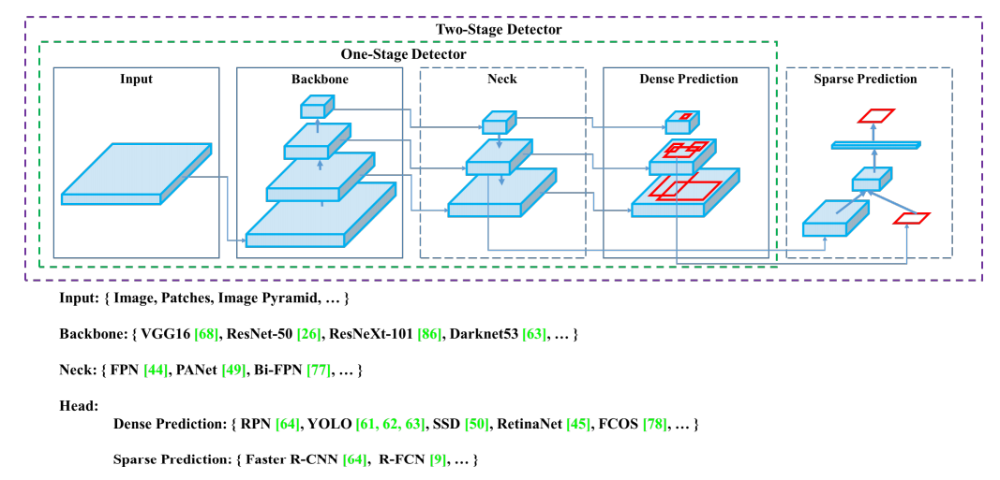
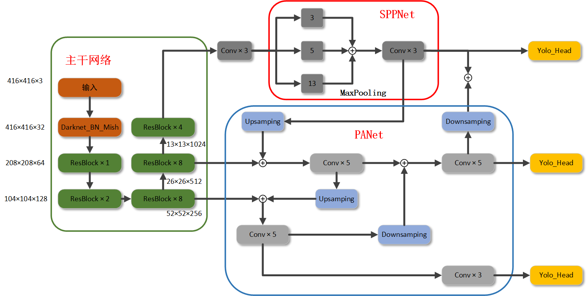
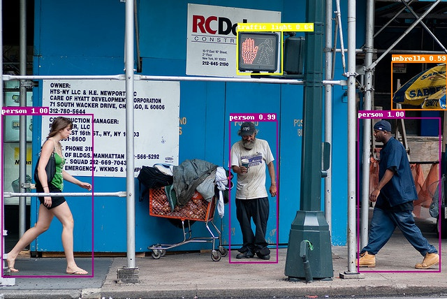

# YOLOv4-Based-on-PaddleDetection
## 一、说明

### YOLOv4

论文链接：https://arxiv.org/pdf/2004.10934v1.pdf

作为YOLO系列经典检测网络，YOLOv4继承了YOLOv3的优势，总结了单阶段网络可以分为主干backbone、颈部neck和头部head三个部分、同时引入了大量的训练技巧、新的检测方案和损失方案



YOLOv4由主干网络CSPDarkNet53、颈部网络SPP和PANet、YOLOv3的头部网络组成，如下图所示



本项目基于[AIStudio](https://aistudio.baidu.com/aistudio/index)和[PaddleDetection](https://github.com/PaddlePaddle/PaddleDetection)开源框架复现了YOLOv4。在[COCO2017](https://cocodataset.org/#home)数据集上进行训练，并在[COCO-test2017](https://competitions.codalab.org/competitions/20794#participate)数据集进行测试，最终测试结果达到mAP=41.7%

### 下载预训练权重，可以通过两种方式进行获取

- 百度网盘链接：https://pan.baidu.com/s/1WvHIuCP88FlQFK4XQwP_sw 
  提取码：2cts 

- AIStudio：https://aistudio.baidu.com/aistudio/datasetdetail/106545

  将获取到的预训练权重复制到work/pretrain_model目录下（与配置文件对应）

```sh
cp data/data106469/yolov4_cspdarknet.pdparams work/pretrain_model
```

### COCO2017数据集

AIStudio：https://aistudio.baidu.com/aistudio/datasetdetail/7122

## 二、步骤

### step0.创建AIStudio环境

paddle选用2.0以上版本

GPU选用TeslaV100 32G及以上

数据集选用[COCO2017数据集](https://aistudio.baidu.com/aistudio/datasetdetail/7122)和训练好的[权重](https://aistudio.baidu.com/aistudio/datasetdetail/106545)（可在创建项目中添加数据集搜索选择）


### step1.克隆本项目到work目录下

```sh
cd ~/work
git clone https://github.com/Windxy/YOLOv4-Based-on-PaddleDetection.git
cd ~
```


### step2.安装pycocotools

```sh
pip install pycocotools
```


### step3.解压数据集

```sh
cd ~/data/data7122
unzip ann*.zip
unzip val*.zip
unzip image_info*.zip
unzip train*.zip
unzip test*.zip
cd ~/w
```


### step4.将data7122重命名为coco

```sh
mv /home/aistudio/data/data7122 /home/aistudio/data/coco 
```


### step5.训练 and 评估

```sh
python PaddleDetection/tools/train.py -c yolov4_cspdarknet_coco.yml --eval -o use_gpu=true
```


### step6.评估

```sh
python PaddleDetection/tools/eval.py -c yolov4_cspdarknet_coco.yml -o use_gpu=true
```


### step7-1.测试

```sh
python PaddleDetection/tools/eval.py -c yolov4_cspdarknet_coco_test.yml -o use_gpu=true
```

### step7-2.上传官网进行测试评估

```sh
1.将测试集测试结果得到的bbox.json进行zip打包
2.进入https://competitions.codalab.org/competitions/20794#participate，注册并submit打包后的zip文件
3.下载输出结果
```


### step8.推理测试自己的图片

```sh
python PaddleDetection/tools/infer.py -c yolov4_cspdarknet_coco_test.yml -o use_gpu=true --infer_dir=自己图片的目录
```


## 三、测试结果

### 官网评测结果

进入官网https://competitions.codalab.org/competitions/20794#participate

注册并submit打包后的zip文件（已打包好的zip文件链接：https://pan.baidu.com/s/1HE7Krq0B6_goIsm-nVf2lA 提取码：b9n9 ）

测试后文件存在`coco_test2017_output`目录下

```
 Average Precision  (AP) @[ IoU=0.50:0.95 | area=   all | maxDets=100 ] = 0.417
 Average Precision  (AP) @[ IoU=0.50      | area=   all | maxDets=100 ] = 0.644
 Average Precision  (AP) @[ IoU=0.75      | area=   all | maxDets=100 ] = 0.453
 Average Precision  (AP) @[ IoU=0.50:0.95 | area= small | maxDets=100 ] = 0.247
 Average Precision  (AP) @[ IoU=0.50:0.95 | area=medium | maxDets=100 ] = 0.456
 Average Precision  (AP) @[ IoU=0.50:0.95 | area= large | maxDets=100 ] = 0.513
 Average Recall     (AR) @[ IoU=0.50:0.95 | area=   all | maxDets=  1 ] = 0.331
 Average Recall     (AR) @[ IoU=0.50:0.95 | area=   all | maxDets= 10 ] = 0.531
 Average Recall     (AR) @[ IoU=0.50:0.95 | area=   all | maxDets=100 ] = 0.560
 Average Recall     (AR) @[ IoU=0.50:0.95 | area= small | maxDets=100 ] = 0.374
 Average Recall     (AR) @[ IoU=0.50:0.95 | area=medium | maxDets=100 ] = 0.610
 Average Recall     (AR) @[ IoU=0.50:0.95 | area= large | maxDets=100 ] = 0.697
```

### 单张图片测试结果



